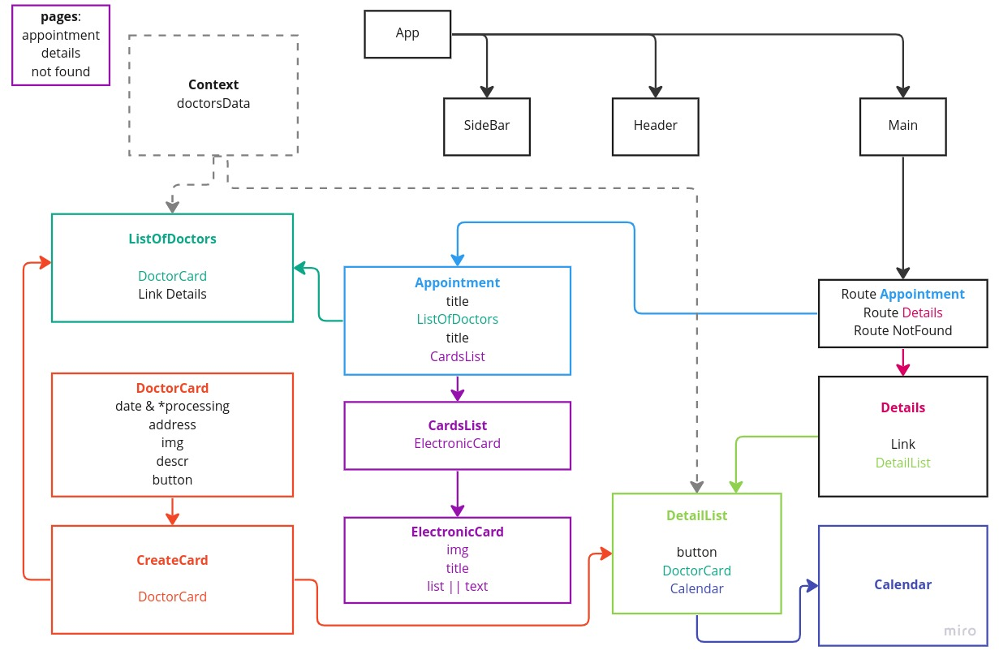

# Задание: реализовать веб-интерфейс управления записями на прием к врачу.

### [Макет в figma](https://www.figma.com/file/tzAMvWF0VkpnLXCTqCtPF5/Test-Frontend?node-id=0%3A1)

### ***Необходимо реализовать экраны:***
>·
личный кабинет список учреждений и поиск врачей,

>·
лк записи на прием *(переход к этому экрану производится при клике на ссылку __Подробноее__ на
экране "личный кабинет список учреждений и поиск врачей")*.

## использовал в процессе разработки:

+ React 
+ React router dom v6
+ Библиотека Classnames
+ Минималистичная библиотека Day.js
+ Для календаря была использована библиотека React-calendar
+ Сontext react  _`использовал потому, что Redux в данном проекте совершенно избыточен`_
+ Верстка по условию задания не адаптивная

